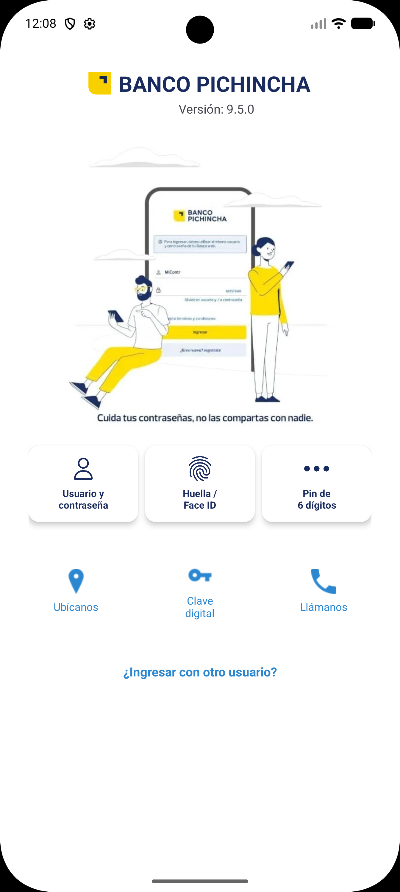

# 🏦 Banco Pichincha App Clone

Replica de la pantalla de inicio de sesión de la aplicación móvil del Banco Pichincha, desarrollada como proyecto académico en Android Studio.

## 📱 Capturas de pantalla

<p align="center">
  
</p>

## 🛠️ Tecnologías utilizadas

- **Android Studio** - Entorno de desarrollo
- **Java** - Lenguaje de programación
- **XML** - Diseño de interfaces
- **Material Design Components** - Componentes UI (MaterialCardView)
- **ConstraintLayout** - Layout principal
- **LinearLayout** - Distribución de elementos

## 📂 Estructura del proyecto

```
BancoPichincha/
├── app/
│   ├── src/
│   │   ├── main/
│   │   │   ├── java/         # Código fuente Java
│   │   │   ├── res/
│   │   │   │   ├── drawable/ # Íconos e imágenes
│   │   │   │   ├── layout/   # Archivos XML de diseño
│   │   │   │   └── values/   # Colores, strings, temas
│   │   │   └── AndroidManifest.xml
```

## ✅ Funcionalidades implementadas

- ✔️ Header con logo y nombre del banco
- ✔️ Versión de la app (9.5.0)
- ✔️ Imagen ilustrativa central
- ✔️ Mensaje de seguridad "Cuida tus contraseñas"
- ✔️ 3 botones de acceso:
  - Usuario y contraseña
  - Huella / Face ID
  - Pin de 6 dígitos
- ✔️ 3 accesos rápidos:
  - Ubícanos
  - Clave digital
  - Llámanos
- ✔️ Enlace "¿Ingresar con otro usuario?"

## 🎨 Colores utilizados

| Color | Hex | Uso |
|-------|-----|-----|
| Azul oscuro | `#1A2B5F` | Títulos y botones principales |
| Azul celeste | `#2C87D1` | Íconos y enlaces |
| Amarillo | `#F5C518` | Logo del banco |
| Blanco | `#FFFFFF` | Fondo y cards |
| Gris claro | `#F0F0F0` | Fondo sección botones |

## 📐 Componentes principales

### Header
- `ImageView` para el logo del banco
- `TextView` para el nombre y versión

### Imagen central
- `ImageView` con la ilustración principal

### Botones de acceso (MaterialCardView)
- 3 cards con ícono y texto centrados
- `cardCornerRadius="12dp"`
- `cardElevation="4dp"`
- Color de fondo: `#FFFFFF`

### Accesos rápidos
- 3 íconos con texto en `LinearLayout` horizontal
- Color: `#2C87D1`

## 👨‍💻 Autor

**Mario**  
Estudiante de Ingeniería en Software  
Universidad Técnica Estatal de Quevedo (UTEQ)  
Facultad de Ciencias de la Computación

## 📌 Nota

Este proyecto es únicamente con fines académicos y educativos. No tiene ninguna afiliación oficial con el Banco Pichincha.
